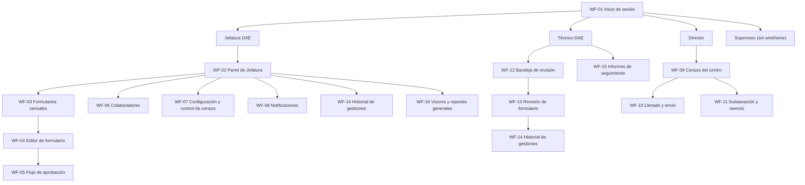

# Mapa de sitio – SICEN

```mermaid
flowchart TD
  WF01["WF-01 Inicio de sesión"] --> J["Jefatura DAE"]
  WF01 --> T["Técnico DAE"]
  WF01 --> D["Director"]
  WF01 --> S["Supervisor (sin wireframe)"]

  J --> WF02["WF-02 Panel de Jefatura"]
  WF02 --> WF03["WF-03 Formularios censales"]
  WF03 --> WF04["WF-04 Editor de formulario"]
  WF04 --> WF05["WF-05 Flujo de aprobación"]
  WF02 --> WF06["WF-06 Colaboradores"]
  WF02 --> WF07["WF-07 Configuración y control de censos"]
  WF02 --> WF08["WF-08 Notificaciones"]
  WF02 --> WF14a["WF-14 Historial de gestiones"]
  WF02 --> WF16["WF-16 Visores y reportes generales"]

  T --> WF12["WF-12 Bandeja de revisión"]
  WF12 --> WF13["WF-13 Revisión de formulario"]
  WF13 --> WF14b["WF-14 Historial de gestiones"]
  T --> WF15["WF-15 Informes de seguimiento"]

  D --> WF09["WF-09 Censos del centro"]
  WF09 --> WF10["WF-10 Llenado y envío"]
  WF09 --> WF11["WF-11 Subsanación y reenvío"]
```

Desde cualquier pantalla, el botón **Salir** regresa a WF-01.
